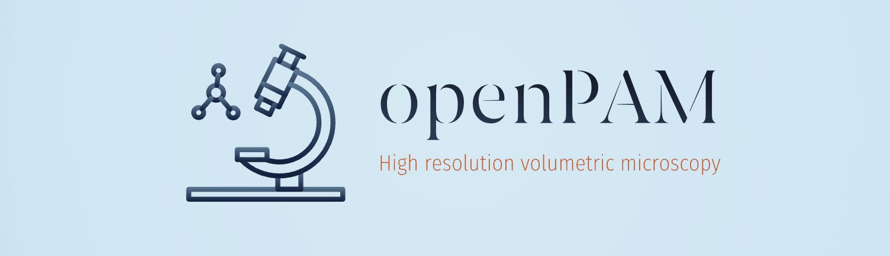
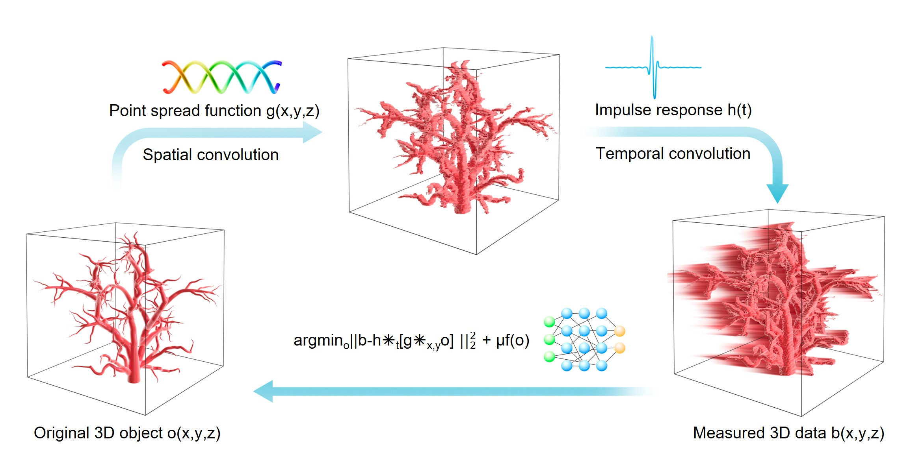
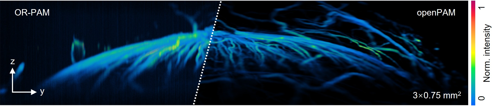
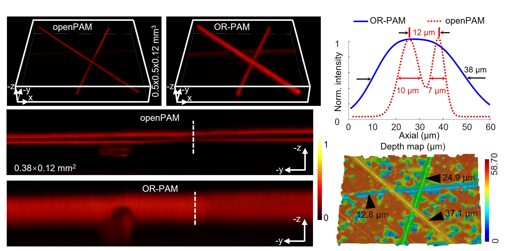
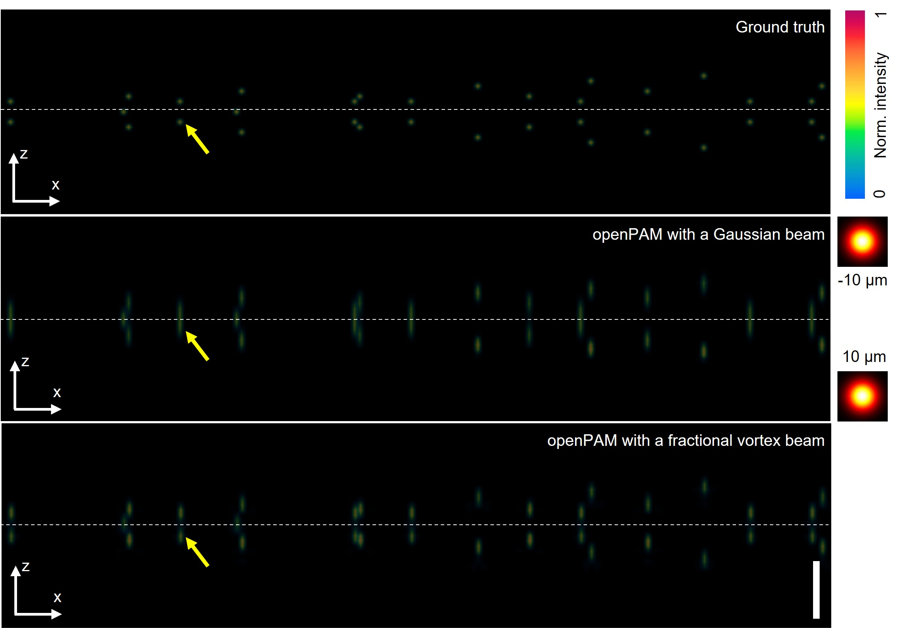

# OpenPAM: Optically encoded photoacoustic microscopy

**This repository is an updated version of the original [openPAM](https://github.com/fengxiaohua102/openPAM2024) and final algorithm implementation deployed in the manuscript**

This repository contains the code and demo dataset for "High resolution volumetric imaging with optically encoded photoacoustic microscopy", which we termed as **openPAM**.


          
**Abstract:**
Optical resolution photoacoustic (optoacoustic) microscopy (OR-PAM/OAM) is a functional volumetric imaging technique that achieves optical diffraction-limited lateral resolution through confined optical excitation and axial profiling via acoustic time-of-flight detection. However, the diffraction-limited lateral resolution is preserved only within a depth of field of approximately 100 μm, while the axial resolution at depths is limited to tens of micrometers due to the finite bandwidth of effectively detected acoustic signals. To overcome these limitations, we developed optically encoded PAM (openPAM), which sculpts the illumination light into a fractional vortex beam to encode the object to be imaged. The resultant measurements are then resolved into high-resolution volumetric images over a large axial range using an efficient neural decoding algorithm. To demonstrate the superior performance of openPAM, we performed in vivo volumetric imaging of animal vasculature and cancer models, achieving a lateral resolution at 2.6 μm and an unprecedented 6 μm axial resolution over an extended depth of 750 μm, significantly outperforming conventional OR-PAM. The synergy of optical encoding and time-of-flight detection offers a new solution for optical sectioning and can broadly benefit fast and high-resolution volumetric microscopy.




## System requirements
We implemented all of our algorithms using PyTorch 2.8, with CUDA-enabled GPU for acceleration. We tested the algorithms on both Ubuntu and Windows system using Anaconda. For image reconstruction of large volumes, it is recommended to use a modern GPU with a high VRAM (at least 12 GB for PnP-FISTA, while DRP requires a larger VRAM to ensure acceptable reconstruction speed; preferably 48 GB so that the entire volume can be reconstructed without segmentation). Specific system requirements are:

 1. Ubuntu (we tested on 20.04 and 24.04) or Windows 10/11
 2. 64 GB RAM or above
 3. Modern GPU with 12 GB or higher VRAM (48 GB and above is recommended)

## Installation guide
It is recommended to use Anaconda to install a working Python (>=3.9) distribution with all basic packages. Other necessary packages are:

 1. PyTorch 2.0 (higher should also work) with CUDA support
 2. NumPy
 3. SciPy
 4. Matplotlib
 5. tifffile
 6. einops

All these packages can be installed with Anaconda by using the command "conda install xx", with xx being the package name such as 'numpy'.

**Please refer to **environment.yml** for more packages details.**

> Typical installation time: approximately 15-30 minutes on a standard desktop computer with modern gpu and internet connection."

## Pipeline
Based on the data source and the choice of PSF, the code includes two pipeline examples: the **Experimental Reconstruction Pipeline** for reconstruction of experimentally measured data, and the **Simulation Reconstruction Pipeline** for reconstruction of synthetically generated data using Gaussian and Double Helix PSFs.
### Experimental Reconstruction Pipeline
```
ht extraction        Jitter correction       PSF alignment         Neural deconvolution
(Procht.py)    -->   (ProcPAM.py)      -->   (autoAlign.py)    -->   (demo_openPAM.py)
                                                                      
```


### Simulation Reconstruction Pipeline
```
ht extraction        Simulated measurements         Comparison of deconvolutions
(Procht.py)    -->   generation              -->    with gaussian and dh PSFs
                     (generate_sim_gauss_           (demo_openPAM_gauss_dh_
                     dh_meas.py)                    comparison.py)
```



## Demo 
**Important Notice: due to the huge size of the experimental data, we uploaded the demo dataset (a subset of imaging sessions by limiting the field of view) in Google Drive. Please do the following steps before running the demo code**.

 - Download the demo dataset first and merge the ExpData_DH and model_zoo(if needed) folders  with the corresponding folders in the repository root directory (Google Drive link: https://drive.google.com/file/d/1L22CoGjTDEvNddWobxUoMTTVgcUTakrS/view?usp=sharing)
 - Unzip the ht_psf.zip into the /ExpData_DH directory
 - Make sure the final directory structure looks like the following:
```bash
       /ExpData_DH
          /simulation
          /rawdata_eye
            /raw
            /jitter_corrected_results
          /rawdata_ear
          /rawdata_fiber
          ...
          ht.tif
          psf_stack_z2um.tif
          gauss_psf_stack_z2um_0.2NA.tif
          dh_psf_stack_z2um_0.2NA.tif

        /model_zoo
          /restormer
            motion_deblurring.pth
            restormer_gaussian_gray_denoising_sigma25.pth
          drunet_gray.pth
          ffdnet_gray.pth
```
We provide a basic demonstration script where one can modify the dataset to be processed and see the final reconstruction results, and save the output volume into a large tiff image for 3D visualization in other software such as ParaView.
To run the demo script, simply run the following command:
```
python demo_openPAM.py
```

The 3D output will be saved in a large tiff file on the imaging session directory (if not specified in the demo code), where the x-y integral projection image will be rendered by Matplotlib. The demo using PnP-FISTA will take approximately half an hour on a modern GPU (such as NVIDIA RTX A6000), while DRP requires several hours due to the usage of Restormer deblurring network.

> If you want to quickly test the code, you can do a few simple modifications:
>  - Reduce the region of interest (See ROI comments in the demo code) to smaller volumes, which will enable GPUs with smaller VRAM (such as NVIDIA RTX 3090 or 4080) to be used.
>  - Switch from DRP to PnP-FISTA if you don't require the ultimate reconstruction quality 
>  - Reduce the iteration number of the solver to 30 (a good tradeoff between reconstruction quality and time).
>  - Additionally, if you can accept a degradation in reconstruction quality, you can replace the DRUNet with ffdnet. With these modifications, one can obtain the reconstruction within a few minutes.

> **NOTE:**  If you want more control over the demo reconstruction, please follow the comments in the demo code, which is detailed and straightforward to understand.

## Choice of reconstruction algorithms
This repository introduces the [**Deep Restoration Priors (DRP)**](https://wustl-cig.github.io/drpwww/) algorithm in addition to the original openPAM's PnP-FISTA algorithm, enabling improved axial resolution and robustness when deconvolving complex structured samples. Therefore, this project offers two selectable algorithmic frameworks:
### PnP-FISTA (Denoising Prior-based)
 - Suitable for most samples, but may not resolve structures that are too closely spaced axially
 - Faster reconstruction speed, consistently achieving good reconstruction results by default setting
### DRP (Deblurring and Denoising Prior-based)
 - Suitable for complex structured samples (axially dense), achieving better reconstruction results, especially in axial resolution
 - Slower reconstruction speed and higher VRAM cost, requiring fine-tuning of 2 to 3 algorithm parameters for each sample to achieve optimal results

## Instructions for using the code on your own data

You can use the code without modifications for image reconstruction of your own experimental data. To make it work out of the box, please follow the steps listed below:
 >0. Prepare the transducer impulse response (ht) and PSF corresponding to the experiment setup
 >1. Format the 3D time-of-flight measurement data in the order of x-y-t (numpy or torch Tensor)
 >2. (Optional) Correct any synchronization or sampling jitter to achieve best possible axial resolution (please refer to ProcPAM.py for more detailed implementation)
 >3. Process the data to be zero-mean and normalize it to the range of [-1, 1]
 >4. Calculate the PSF shift value relative to the encoding measurement in the medium (please refer to autoAlign.py for more detailed implementation)
 >5. Perform openPAM neural deconvolution
 >6. Specify where the image results should be stored so that you can find them
 
 After all these steps, you should be able to run the code and monitor the reconstruction process in a terminal, and obtain the results after some time (for reference, reconstructing a full 1000 × 1000 × 512 volume with the PnP-FISTA algorithm on an RTX 6000 will take about half an hour).

 **Alternatively, you may first perform openPAM simulation tests directly on your own experimental data for quick performance evaluation (please refer to the Simulation Reconstruction Pipeline for details).**
 
## Acknowledgement
This work benefits from a number of awesome open-source works that provided the pretrained deep neural denoisers and algorithm framework, in particular, the drunet (and ffdnet, restormers that had been tested as well).
We chose drunet for its state-of-the-art denoising performance and decent running speed for denoising large 3D volumes. We recommend reading the associated papers and downloading the pretrained networks
from their official github repositories:

 1. DRUNet: https://github.com/cszn/DPIR/tree/master
 2. FFDNet: https://github.com/cszn/FFDNet
 3. Restormer: https://github.com/swz30/Restormer
 4. DRP: https://github.com/wustl-cig/DRP

## Citation
If you find our code and method useful, and wish to know more details of openPAM, please refer to our manuscript and consider citing it. We will update it as soon as we can. Stay tuned!
```
@article{openPAM,
  title={High-resolution volumetric imaging with optically encoded photoacoustic microscopy (openPAM)},
  author={Jiayu Zhao, Yueming Li, Zhitong Lai, Zhiling Zhang, Yuecheng Shen, Xiankun Qiu, Jiawei Luo, Fangzhou Jin, Yongkang Zhang, Yang Ran, Jun Ma, Bing Cong, Hengfeng Yan, Daixuan Wu, Zhengyang Wang, Jiaming Liang, Dalong Qi, Yunhua Yao, Lianzhong Deng, Zhenrong Sun, Bai-Ou Guan, Xiaohua Feng and Shian Zhang},
  journal={arXiv preprint arXiv:xxx.xxx},
  year={2025},
}
```


