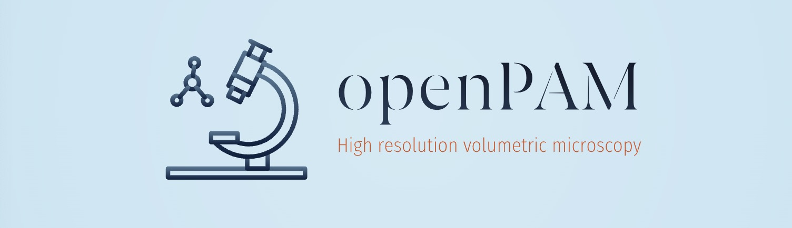
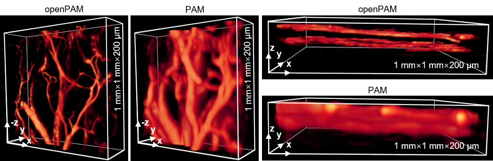

# OpenPAM: Optically encoded photoacoustic microscopy

This repositoary contains the code and example dataset for "High resolution volumetric imaging with optically encoded photoacoustic microscopy", which we termed as **openPAM**.
          
          
**Absract:**
Photoacoustic microscopy (PAM) is a functional volumetric imaging technique that achieves optical diffraction-limited lateral resolution through confined optical
excitation and axial profiling via acoustic time-of-flight detection. However, the diffraction-limited lateral resolution is maintainable only within a depth of field of
approximately 100 μm, and the axial resolution is restricted to tens of micrometers due to the finite bandwidth of acoustic signals. To overcome these limitations, we developed
optically encoded PAM (openPAM), which sculpts the illumination light into a fractional vortex beam to encode the object to be imaged. The resultant measurements
are then resolved into high-resolution volumetric images over a large axial range using an efficient neural decoding algorithm. To demonstrate the superior performance of
openPAM, we performed in vivo volumetric imaging of animal vasculature and cancer models, achieving an unprecedented isometric 3.5-μm resolution over an extended
depth of 1.5 mm, significantly outperforming conventional PAM. The synergy of optical encoding and time-of-flight detection offers a new solution for optical
sectioning and can broadly benefit fast and high-resolution volumetric microscopy.

## System requirements

We implemented all of our algorithms using PyTorch 2.0, with CUDA-enabled GPU for acceleration. We tested the algorithms on both Ubuntu and Windows system using Anaconda. For image reconstruction of large volumes, it is recommended to use a modern GPU with a high VRAM (at least 12 GB and preferrably 48 GB so that the entire volume can be reconstructed without segmentation). Specific system requirements are:

 1. Ubuntu (we tested only on 20.04) or Windows 10
 2. 64 GB RAM
 3. 12 GB or higher VRAM

## Installation guide

It is recomended to use Anaconda to install a working Python (>=3.19) distribution with all basic packages. Other necessary packages are :

 1. PyTorch 2.0 (higher should also work) with CUDA support.
 2. Numpy
 3. Scipy
 4. tqdm
 5. tifffile

All these packages can be install with Anaconda by using the command 'conda install xx", with xx being the package name such as 'numpy'.

## Demo

We provide a basic demonstration script where one can mondify the dataset to be processed and see the final reconstruction results, and save the output volume into a large tiff image for 3D visualization in other software such as ParaView.
To run the demo script, simply run the following command:
> python demo_openpam.py

The 3D output will be saved in a large tiff file on the root directory (if not specified in the demo code), where the x-y integral projection image will be rendered by matplotlib. The demo will take about half hour for a modern GPU (such as GTX A6000). 
> If you want to quickly test the code, simply modifiy the region of interest (See ROI comments in the demo code) to smaller volumes, which will enalbe GPUs with smaller VRAM (such as GTX 2080, 3090 or 4080) to be used and reduce the recontruction time to less than ten minutes.

> **NOTE:**  If you want more control over the demo reconstruction, please follow the comments in the demo code, which is detailed and straightforward to understand.

## Instructions for using the code on your own data

You can use the code without modifications for image reconstruciton of your own experimental data. To make it work out of the box, please follows the steps listed below:

 1. Format the 3D time-of-flight measurement data in the order of x-y-t (numpy or torch Tensor)
 >2. (Optionally) Correct any synchronization or sampling jitter to achieve best possible axial resolution
 3.  Process the data to be zero-mean and normlize it to the range of [-1, 1].
 >4. Modify where the image results should be stored so that you can find it.
 
 After all these steps, you should be able to run the code and monitoring the recontruction process on a terminal, and obtain the results after some time (for references, recontructing a full 1000 X 1000 X 512 volume on a GTX A6000 will take about half hour).

## Related Publication

For more details of openPAM, please refered to our manuscript. 'High resolution volumetric imaging with opticall encoded photoacoustic microscopy', arxiv, which will be updated soon.
Stay tuned!

